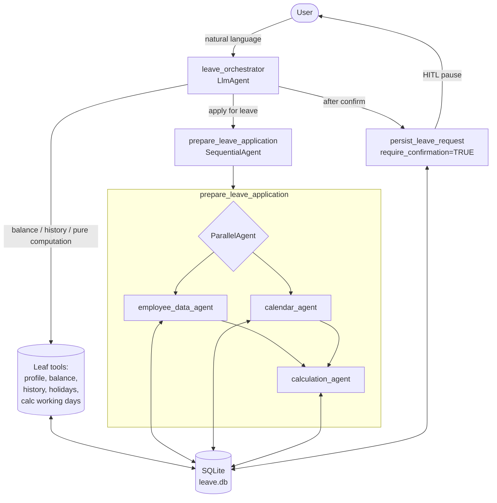

# Architecture

- **Sequential:** `prepare_leave_application` runs retrieval then calculation in order.
- **Parallel:** `employee_data_agent` and `calendar_agent` run concurrently inside the `ParallelAgent`.
- **Human-in-the-loop:** `persist_leave_request` body executes only after explicit confirmation; the SQLite write lives inside that body.
